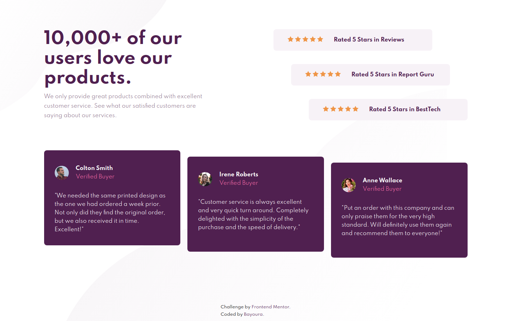

# Frontend Mentor - Social proof section solution

This is a solution to the [Social proof section challenge on Frontend Mentor](https://www.frontendmentor.io/challenges/social-proof-section-6e0qTv_bA). Frontend Mentor challenges help you improve your coding skills by building realistic projects. 

### The challenge

Users should be able to:

- View the optimal layout for the section depending on their device's screen size

## Links

- [View Code](https://github.com/Bayoura/social-proof-section)
- [Live Demo](https://bayoura.github.io/social-proof-section/)

## Built with

- HTML
- CSS
- Flexbox
- mobile first workflow

## What I learned

- This project was good for practising my layout skills. I used flexbox for this.

## Author

- [codepen](https://codepen.io/bayoura)
- [GitHub](https://github.com/Bayoura)
- [Frontend Mentor](https://www.frontendmentor.io/profile/Bayoura)